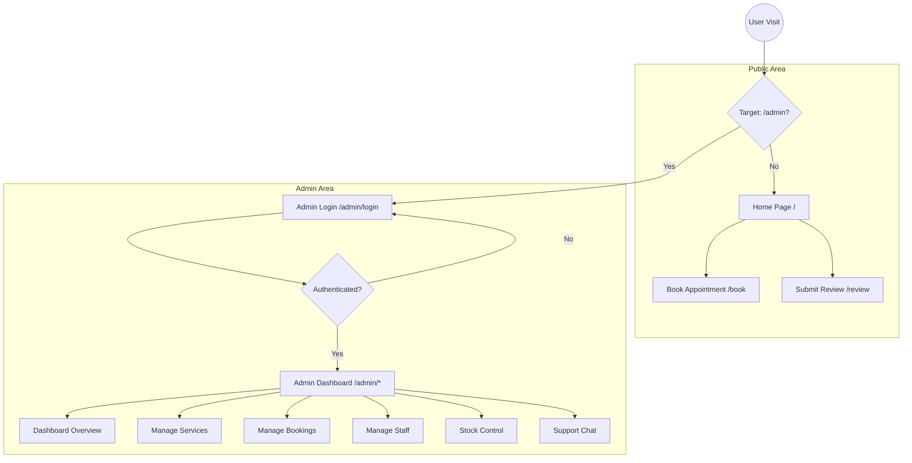

# Bria Unisex Salon - Frontend Documentation

This document provides a comprehensive overview of the Bria Salon frontend architecture, project structure, and environment configuration.

## 🏛 Architecture Overview

The frontend is built with **React** and **Vite**, utilizing a **Feature-Based Modular Architecture**. This design ensures that each functional area of the salon (e.g., Bookings, Services, Inventory) is isolated, making the codebase highly maintainable and scalable.

### Project Structure

```text
src/
 ├── config/                 # Centralized API and App configuration
 │   └── api.js              # Unified Axios client with interceptors
 ├── features/               # Functional modules (Feature Layers)
 │   ├── [feature]/           # e.g., auth, bookings, services
 │   │   ├── [Feature].jsx    # Main UI component for the feature
 │   │   ├── [feature]Service.js # Feature-specific API logic
 │   │   └── components/     # Sub-components unique to this feature
 ├── shared/                 # Shared resources (Cross-cutting layer)
 │   ├── components/         # Layout, UI components used everywhere
 │   ├── context/            # AuthContext, CartContext, etc.
 │   ├── hooks/              # Reusable custom hooks
 │   └── utils/              # Helper functions and constants
 ├── App.jsx                 # Route management and provider nesting
 └── main.jsx                # Application entry point
```

### Key Design Principles
1.  **Feature Isolation**: Each feature in `src/features` is as self-contained as possible.
2.  **Centralized API Client**: All HTTP requests flow through a unified `apiClient` in `src/config/api.js`, which handles authentication tokens and global error responses.
3.  **Shared Layer**: Generic logic and UI elements are pulled into `src/shared` to avoid duplication.

---

## 🛠 Tech Stack
- **Library**: React 18
- **Build Tool**: Vite
- **Styling**: Tailwind CSS / Vanilla CSS
- **Routing**: React Router DOM 6
- **Animations**: GSAP (GreenSock Animation Platform)
- **Icons**: Lucide-React
- **HTTP Client**: Axios

---

## 📊 Application Flow

The following diagram illustrates the high-level flow of a user through the application.



---

## 🔑 Environment Variables

The application requires specific environment variables to communicate with the backend. Copy `env.example` to `.env` in the root directory.

| Variable | Description | Default / Example |
| :--- | :--- | :--- |
| `VITE_API_BASE_URL` | Base URL for the backend API | `http://localhost:8000` |
| `VITE_APP_NAME` | Display name of the application | `Bria Salon` |
| `VITE_APP_DESCRIPTION` | App meta description | `Modern Salon management` |
| `VITE_DEBUG_MODE` | Enable/Disable debug logs | `false` |

---

## 🚀 Development & Build

### 1. Local Setup
```bash
# Install dependencies
npm install

# Setup environment
cp env.example .env

# Run development server
npm run dev
```

### 2. Production Build
```bash
# Create optimized production build
npm run build

# Preview the build locally
npm run preview
```

---

## 🔒 API Connectivity

All features interact with the backend via a pre-configured `apiClient`.

- **Interceptors**: The client automatically looks for an `authToken` in `localStorage` and attaches it to the `Authorization` header.
- **Error Handling**: If the API returns a `401 Unauthorized` (expired session), the client automatically redirects the user to the login page.
